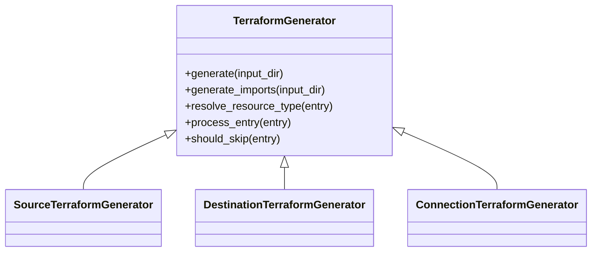
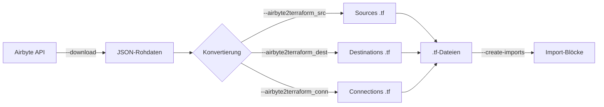

# Airbyte → Terraform Converter

Tool zur automatisierten Überführung bestehender Airbyte-Konfigurationen in deklarativen Terraform-Code.

Sources, Destinations und Connections werden direkt aus der Airbyte-API ausgelesen und als reproduzierbare `.tf`-Dateien inklusive Import-Blöcken erzeugt statt sie manuell nachzubauen. So lässt sich eine gewachsene Airbyte-Umgebung unter IaC-Verwaltung bringen.
## Hintergrund

Dieses Projekt entstand im beruflichen Kontext. Die Veröffentlichung erfolgt mit Genehmigung. Es wurden keine vertraulichen oder unternehmensspezifischen Informationen übernommen.

---

## Features

- Extraktion von Airbyte-Konfigurationen über die API (mit Pagination und Bearer-Token-Auth)
- Generierung von Terraform-Ressourcen (Sources, Destinations, Connections)
- Template-basierte Code-Erzeugung (Jinja2)
- Mapping-System für unterschiedliche Connector-Typen
- Automatisches Ersetzen sensibler Felder durch sprechende Platzhalter um sicherzustellen, dass maskierte Secrets eindeutig als nachzutragend erkennbar sind
- Optionales Ersetzen beliebiger Felder durch Terraform-Variablen zur Parametrisierung des generierten Codes
- Behandlung von Legacy- und inkompatiblen Feldern
- Generierung von **Terraform Import-Blöcken** für bestehende Ressourcen
- Deterministische Erstellung reproduzierbarer `.tf`-Dateien

---

## Architektur & Design

Der Kern basiert auf einer `TerraformGenerator`-Basisklasse, die per **Template Method Pattern** den Generierungsablauf vorgibt: `generate()` bzw. `generate_imports()` legen den festen Ablauf fest, während einzelne Schritte über überschreibbare Hook-Methoden (z. B. `should_skip`, `process_entry`, `resolve_resource_type`) angepasst werden. Die Basisklasse liefert dabei für alle Hooks sinnvolle Defaults und konfiguriert sich primär über Konstruktor-Parameter. Neue Connector-Typen lassen sich so durch Konfiguration oder gezieltes Überschreiben einzelner Hooks ergänzen, ohne die Kernlogik zu duplizieren.



**Designprinzipien:**

- **Klare Trennung der Concerns:** API-Abruf (`api_processing`), Konfiguration (`core_config`), Generierung (`gen_terra`) und Hilfsfunktionen (`utils`) sind strikt entkoppelt.
- **Typsicherheit:** Airbyte-Strukturen sind als `TypedDict` modelliert, Schnittstellen über `Protocol` definiert.
- **Robustes Config-Layering:** Bootstrap der Basiskonfiguration via `pydantic-settings` mit klarer Prioritätskette (Konstruktor → `config.json` → `.env` → System-Env). Die Auflösung des Projekt-Roots liegt in einem separaten, abhängigkeitsarmen Modul (`root_path.py`), was zentrale Pfadauflösung ermöglicht und zirkuläre Importe vermeidet.
- **Sicherer Umgang mit sensiblen Feldern:** Von der API maskierte Secrets kommen nur als generische Sternchen an, die keinen Rückschluss auf das ursprüngliche Feld zulassen. Sensible Keys werden daher auf sprechende Platzhalter (z. B. `__PLACEHOLDER_PASSWORD__`) gemappt, sodass im generierten Code eindeutig erkennbar ist, welches Feld nachgetragen werden muss. Das verhindert, dass ein maskiertes Feld übersehen oder versehentlich falsch befüllt wird.
- **Parametrisierung über Terraform-Variablen:** Unabhängig davon lassen sich beliebige Felder über eine Mapping-Datei durch Terraform-Variablen ersetzen. Zum Beispiel für Werte, die aus der API zwar übernehmbar wären, aber bewusst parametrisiert werden sollen (z. B. `workspace_id`). Hier ist zu beachten, dass gleichnamige Felder aus verschiedenen Einträgen kollidieren können.
- **Aussagekräftige Fehlercodes:** Kombinierbare Exit-Codes über `IntFlag`, sodass mehrere Teilfehler eines Laufs in einem einzigen Code abgebildet werden.

### Ableitung der Terraform-Felder via Reflection

Welche Felder einer Airbyte-Ressource in den Terraform-Code übernommen werden, wird nicht über manuell gepflegte Black-/Whitelists gesteuert, sondern direkt aus den `TypedDict`-Definitionen abgeleitet (`__required_keys__` / `__optional_keys__`). Die Typdefinition ist damit die einzige Quelle der Wahrheit. Ändert Airbyte künftig sein Schema, genügt eine Anpassung des `TypedDict`, ohne dass separate Listen nachgezogen werden müssen.

Die `TypedDict`-Definitionen sind bewusst eng an der offiziellen Airbyte-Dokumentation gehalten, unterteilt in **Required**, **Optional** und (als Kommentar) **Read-Only**-Felder. Das hält die Definition übersichtlich und nahezu abstraktionsfrei: Änderungen lassen sich praktisch direkt aus den Docs übertragen.

```python
class AirbyteSource(TypedDict):
    # Required (according to docs)
    name: Required[str]
    workspaceId: Required[str]
    configuration: Required[dict[str, Any]]
    # Optional
    definitionId: NotRequired[str]
    resourceAllocation: NotRequired[str]
    secretId: NotRequired[str]
    # Read Only
    # sourceId (String)
    # createdAt (Number)
    # sourceType (String)
```

Die auskommentierten Read-Only-Felder dienen als Referenz: Sie dokumentieren, dass diese Felder existieren, fließen aber nicht in den generierten Code ein.

---

## Pipeline



---

## Quick Start

```bash
git clone https://github.com/tobiask42/airbyte-2-terraform-converter.git
cd airbyte-2-terraform-converter
uv sync
uv run python src/main.py --all
```

---

## Voraussetzungen

- Python 3.13+
- Zugang zu einer Airbyte API
- `uv` (Dependency Management)

---

## Konfiguration

Die Steuerung erfolgt über Dateien im `configs/`-Verzeichnis.

### 1. Umgebungsvariablen

Beispiel (`.env`):

```
ENDPOINT_AB1=https://api.airbyte.local/api/public/v1/
ENDPOINT_AB2=https://api.airbyte-v2.local/api/public/v1/
CLIENT_ID_AB1=<client_id>
CLIENT_SECRET_AB1=<client_secret>
```

### 2. API-Konfiguration (`api_config.yml`)

Definiert die abzurufenden Endpunkte:

```yaml
- name: airbyte1_sources
  endpoint: ${ENDPOINT_AB1}sources
  next_key: next
  items_key: data
  filename: sources_ab1
  headers:
    accept: application/json
    content_type: application/json

- name: airbyte1_token
  endpoint: ${ENDPOINT_AB1}applications/token
  headers:
    accept: application/json
    content_type: application/json
```

### 3. Auswahl der Endpunkte (`api_selection.json`)

`tokens` ordnet jedem Prefix eine Token-Config zu: Alle `data`-Einträge, die mit dem Prefix beginnen (`startswith`), werden über das zugehörige Token authentifiziert. Einträge ohne passendes Prefix werden ohne Auth geladen.

```json
{
  "tokens": {
    "airbyte1": "airbyte1_token"
  },
  "data": [
    "airbyte1_sources",
    "airbyte1_destinations",
    "airbyte1_connections",
    "airbyte2_sources",
    "airbyte2_destinations",
    "airbyte2_connections"
  ]
}
```

> **Hinweis:** Die Zuordnung erfolgt über einfaches Prefix-Matching (`startswith`). Da die Konfigurationsdateien manuell gepflegt werden, ist dies bewusst schlank gehalten; die Prefixe sollten eindeutig gewählt werden (z. B. `airbyte1`, `airbyte2`).

---

## CLI Usage

```bash
uv run python src/main.py [OPTIONS]
```

Mindestens ein Flag muss angegeben werden.

### Optionen

| Kurzform | Langform | Beschreibung |
|----------|----------|--------------|
| `-dl`   | `--download`              | Daten aus Airbyte laden und als JSON speichern |
| `-a2ts` | `--airbyte2terraform_src` | Sources in `.tf`-Dateien konvertieren |
| `-a2td` | `--airbyte2terraform_dest`| Destinations in `.tf`-Dateien konvertieren |
| `-a2tc` | `--airbyte2terraform_conn`| Connections in `.tf`-Dateien konvertieren |
| `-ci`   | `--create-imports`        | Import-Blöcke für bestehende Ressourcen generieren |
| `-a`    | `--all`                   | Führt alle Schritte aus |

> `--create-imports` wirkt nur in Kombination mit mindestens einem der Konvertierungs-Flags (`-a2ts`, `-a2td`, `-a2tc`) bzw. `--all`.

> **Exit-Codes** sind als kombinierbare Bit-Flags umgesetzt (`0` = Erfolg, `1` = Download, `2` = Source, `4` = Destination, `8` = Connection, `16` = Import). Mehrere Teilfehler eines Laufs ergeben einen kombinierten Code.
---

## Output

- Terraform-Dateien (`.tf`)
- Import-Blöcke für bestehende Ressourcen
- JSON-Rohdaten
- Log-Dateien

---

## Hinweis

Dieses Projekt ist als generisches Beispiel für IaC-Automatisierung gedacht und wurde von konkreten Umgebungen abstrahiert.